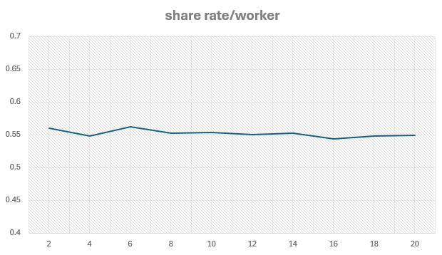

# DuinoI2C_ESP
This project is designed to mine Duino-Coin using an ESP8622 as a I2C master and up to ~~10~~ **20** AVR workers.

## Feature Highlights
1. **High share rate**. The DUCO earning highly dependent on number of share found and submitted. Higher share rate means higher earning!
2. **More workers**. Up to 20 workers* without significant impact on the share rate!
3. **Portability**. DuinoI2C_ESP allow up to 2 WiFi credential to be stored. So no more worries if you're moving the mining rig between 2 places.
4. **View live stats on OLED**. DuinoI2C_ESP provides mining statistic summary and detailed worker status, right from the OLED.
5. **View live stats on web serial**. Detailed info like share acceptance, share rate, ping time will scroll up non-stop during normal operation.
6. **Firmware update via WiFi**. After loading DuinoI2C_ESP via cable the first time, subsequent update can be done over WiFi. Bye cable!
7. **Breathing LED**. Onboard LED will indicate if the ESP is running happily.
8. **Dark ambient friendly**. Control the brightness of the OLED, turn ON/OFF the OLED and onboard LED at will from your phone/computer.
9. **ESP Restart**. Any time when ESP act abnormally, restart it with a click of a button or from your phone/computer.
10. **CRC8 Integrity**. I2C communication between ESP and AVR is CRC8 protected to ensure data is corruption free

*\*[Unlocked](https://github.com/JK-Rolling/DuinoI2C_ESP/tree/main/esp8266#unlock-key). For Locked firmware, free up to 3 workers*

## Mining Rig Setup

*GIF edited to 1 second/screen, no speed up*

### Connection Pinouts
|| ESP8266 | ESP01 | OLED | Logic Level Converter | Arduino | ATTiny85 | Pico |
|:-:| :----: | :----: | :--: | :-----: | :-----: | :-----: | :-----: |
|3.3V|3.3V | 3.3V | VCC | <---> | 5V | 5V | Vsys |
|5V|||| <---> | 5V | 5V | Vsys |
|GND|GND | GND | GND | <---> | GND | GND | GND |
|`SCL`|D1 (GPIO5) | GPIO2 | SCL | <---> | A5 | PB2 | GP27 & GP21 (no LLC needed)|
|`SDA`|D2 (GPIO4) | GPIO0 | SDA | <---> | A4 | PB0 | GP26 & GPP20 (no LLC needed)|

## ESP8266 Setup
See [esp8266](https://github.com/JK-Rolling/DuinoI2C_ESP/tree/main/esp8266) section of this repository.

## AVR Setup
See [worker](https://github.com/JK-Rolling/DuinoI2C_ESP/tree/main/worker) section of this repository.

## Example Rig
Pull-up resistor is highly recommended but not compulsory. YMMV. 

All example rig below is using ESP8266/ESP01 as master. Power distribution is up to personal preference. Rule of thumb is, if the logic level between master and worker is different, use logic-level-converter (LLC).

The combination of ESP and workers depends on ones creativity.

Minimalist :point_up_2:

Heavy Lifter :point_up_2:

miniPico :point_up_2:

miniTiny :point_up_2:

miniNano :point_up_2:

## Share rate per Pico worker
Based on actual data on RP2040 worker. Job diff 128, Hashrate 4.3KH/s, Ping time 140ms. Measurement taken from average share rate since first share submission.

The graph shows a share rate of around 0.55 shares/worker from 2 to 20 workers. No significant drop in share rate when more workers are added. This also indicates the share rate will only increase if the ping time is lower.

## Contact
Official Duino-Coin Discord server: [discord.gg](https://discord.gg/duino-coin-677615191793467402) look for Developer:`JK Rolling` Beta Tester:`jpx13` `Dark_Hunter` `oxy`

Link to this page: https://bit.ly/DuinoI2C_ESP
