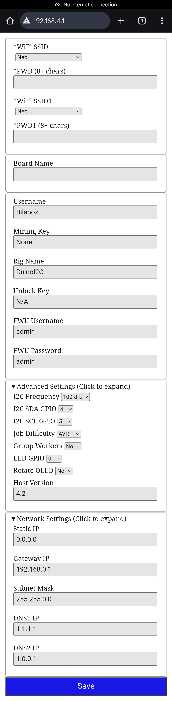
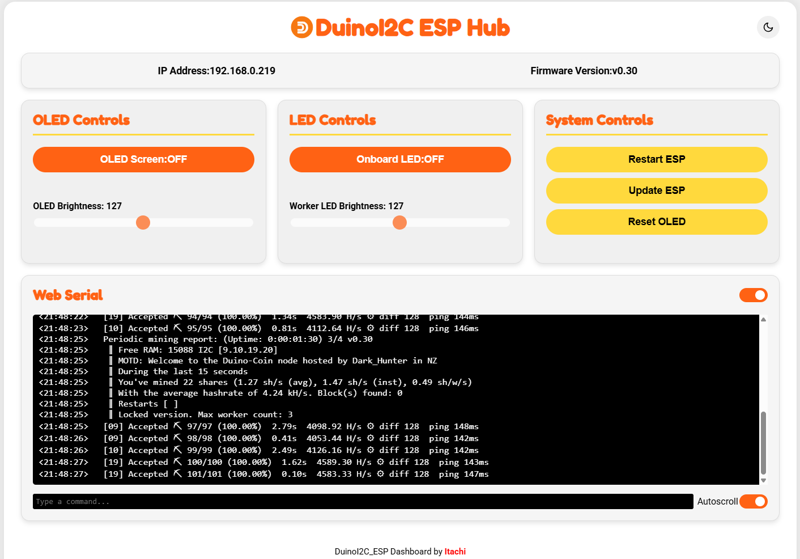
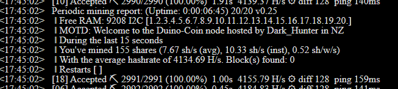
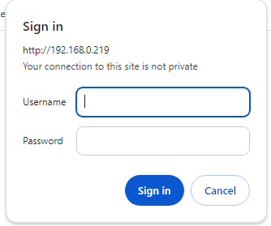
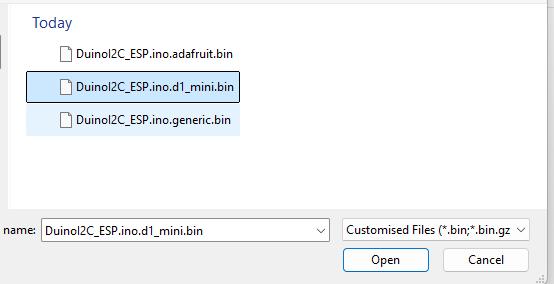

# DuinoI2C_ESP

## Overview
DuinoI2C_ESP is a project designed to run in ESP8266. It'll act as a host to get jobs from Duino-Coin server, then distribute jobs to AVR workers via I2C. DuinoI2C_ESP provides a pre-compiled `.bin` file that you can easily download and upload to your ESP8266.

## Version
0.24

## Supported Devices
This project currently supports the following ESP8266 devices:
- Adafruit Feather HUZZAH ESP8266
- ESP-01S (min. 1MB)
- LOLIN(WEMOS) D1 R2 & mini

*Note: Additional devices may be added upon request. Limited to ESP8266 listed in Arduino IDE board manager*

### Corresponding `.bin` for the ESP8266
|  | Adafruit Feather HUZZAH ESP8266 | ESP-01S (min. 1MB) | LOLIN(WEMOS) D1 R2 & mini |
| :-: | :-: | :-: | :-: |
| DuinoI2C_ESP.ino.d1_mini.bin | :x: | ❌ | ✅ |
| DuinoI2C_ESP.ino.d1_mini.400K.bin | :x: | ❌ | ✅ |
| DuinoI2C_ESP.ino.d1_mini.TxRxPwr.bin | :x: | ❌ | ✅ |
| DuinoI2C_ESP.ino.adafruit.bin | ✅ | ❌ | :x: |
| DuinoI2C_ESP.ino.esp01.bin | :x: | ✅ | :x: |
| DuinoI2C_ESP.ino.esp01.400K.bin | :x: | ✅ | :x: |
| DuinoI2C_ESP.ino.esp01.ota.bin.gz | :x: | ✅ (OTA) | :x: |

> [!IMPORTANT]
> ESP-01 with 1MB can use all esp01 .bin listed above but only filename with `ota` can perform over-the-air update successfully due to flash size limitation.

## Feature
||SERIAL (500Kbps)|WEB_SERIAL|DASHBOARD|I2C_SCL|OLED|CRC8|OTA|mDNS|OLED PWR via TXRX|Dim Worker LED|Breathing LED|Static IP|
| :-: | :-: | :-: | :-: | :-: | :-: | :-: | :-: | :-: | :-: | :-: | :-: | :-: |
| DuinoI2C_ESP.ino.d1_mini.bin | ✅ | ✅ | ✅ | 100KHz | ✅ | ✅ | ✅ | ✅ | :x: | ✅ | ✅ | ✅ |
| DuinoI2C_ESP.ino.d1_mini.TxRxPwr.bin | :x: | ✅ | ✅ | 100KHz | ✅ | ✅ | ✅ | ✅ | ✅ | ✅ | ✅ | ✅ |
| DuinoI2C_ESP.ino.adafruit.bin | ✅ | ✅ | ✅ | 100KHz | ✅ | ✅ | ✅ | ✅ | :x: | ✅ | ✅ | ✅ |
| DuinoI2C_ESP.ino.esp01.bin | ✅ | ✅ | ✅ | 100KHz | ✅ | ✅ | :x: | ✅ | :x: | ✅ | :x: | ✅ |
| DuinoI2C_ESP.ino.esp01.ota.bin.gz | :x: | ✅ | :x: | 100KHz | :x: | ✅ | ✅ | :x: | :x: | :x: | :x: | ✅ |
| DuinoI2C_ESP.ino.esp01.400K.bin | ✅ | ✅ | ✅ | 400KHz | ✅ | ✅ | :x: | ✅ | :x: | ✅ | :x: | ✅ |
| DuinoI2C_ESP.ino.d1_mini.400K.bin | ✅ | ✅ | ✅ | 400KHz | ✅ | ✅ | ✅ | ✅ | :x: | ✅ | ✅ | ✅ |

*Note: Contact me in official Duino-Coin [discord](https://discord.gg/duino-coin-677615191793467402) for custom feature combination or place your request in [discussion](https://github.com/JK-Rolling/DuinoI2C_ESP/discussions/2)*

## How to Download and Upload the `.bin` File

### Downloading the `.bin` File
1. Navigate to the [esp8266](https://github.com/JK-Rolling/DuinoI2C_ESP/tree/main/esp8266) section of this repository.
2. Download the `.bin` file corresponding to your ESP8266 board to your local machine.

*Note: If you want OTA for ESP01, use `DuinoI2C_ESP.ino.esp01.ota.bin.gz`*

### Uploading the `.bin` File to ESP8266
There are 2 ways to upload the `.bin`. Web Browser is the easier way.

#### > Web Browser
1. Visit https://esp.huhn.me/
2. Click `CONNECT` button
3. Select the ESP8266 and click `Connect`
4. On first row, click `SELECT`, then browse to the .bin file downloaded
5. Click `ERASE`
6. Click `PROGRAM`
7. When done. Reset or power cycle the ESP manually

For more help: Visit [espwebtool help](https://blog.spacehuhn.com/espwebtool)

#### > esptool
##### >> Linux
1. (First Time) `pip install esptool`
2. `esptool.py --chip esp8266 --port /dev/ttyUSB0 erase_flash`. Replace device path to your actual one. Note that erase flash will wipe out all existing data including WiFi credential. Skip this step if you want to keep them.
3. `esptool.py --chip esp8266 --port /dev/ttyUSB0 --baud 115200 write_flash 0x00000 DuinoI2C_ESP.bin`. Replace device path and .bin path to your actual one

##### >> Windows CLI
1. (First Time) Download esptool from [esp_tool](https://github.com/espressif/esptool/releases). Example: esptool-v4.7.0-win64.zip
2. (First Time) Extract the .zip then look for esptool or esptool.exe in Windows Explorer
3. Open up a command prompt. You may use `Shift + Right click` in Windows Explorer to pick `Open in Terminal` from menu
4. `esptool.exe --chip esp8266 --port COM4 erase_flash`. Replace COM port to your actual one
5. `esptool.exe --chip esp8266 --port COM4 --baud 115200 write_flash 0x00000 DuinoI2C_ESP.bin`. Replace COM port and .bin path to your actual one

##### >> Windows GUI
Refer to [ESPGUITOOL](https://github.com/CGameDev/ESPGUITOOL). Thanks CGameDev!

## Configure DuinoI2C_ESP
After flashing and powering on your ESP8266 for the first time, it will create a soft access point and launch a WiFi Manager web interface, allowing the user to configure it for proper operation. Note that ESP8266 will only work with 2.4GHz WiFi so the WiFi router may need to enable 2.4GHz if not done so already.

### Connecting to the WiFi Manager
1. Connect your computer or phone to the WiFi network hosted by the ESP8266. You may connect the WiFi network `DuinoI2C_ESP` and key in password as `password` manually or use QR scanner to skip the typing if OLED is connected to the ESP. Or just scan the QR below in this page.
2. Open a web browser and navigate to http://192.168.4.1 by typing in the browser or use QR scanner to skip the typing if OLED is connected to the ESP.
3. The web interface will allow you to configure your WiFi credentials, Duino username and mining key, optionally the firmware OTA credential (FWU - Firmware WiFi Update), and optionally configure static IP address.
4. Click on Save button to store the inputs in ESP8266. The ESP should restart automatically and start working!

 -->  -->  -->  -->  -->  --> 

## Control and Monitor DuinoI2C_ESP
DuinoI2C_ESP web dashboard allow user to access the following
* Webserial
* Firmware WiFi Update (FWU or OTA) with security
* Onboard LED power
* Worker LED brightness
* OLED power and brightness
* ESP Restart

*ESP01 opted OTA will only have Webserial and FWU only*

## Update DuinoI2C_ESP
DuinoI2C_ESP may be updated using USB/USB2Serial or OTA for wireless. Most of ESP8266 comes with 4MB onboard flash so both approach will work. ESP01 of 1MB however, need 2 steps approach for OTA.

### ESP8266 (4MB or more)
1. Navigate to IP address of the ESP with any Internet browser and click `Upload` button
2. Sign in with username and password set during WiFi Manager setup. default username and password is `admin` `admin`
3. Under firmware, click `Choose file`
4. Select your .bin file corresponding to your ESP
5. Click `Update Firmware` and wait around 20s
6. The ESP should restart itself and start working. If it shows WiFi Manager screen, just repeat the WiFi setup step as before

 -->  -->  -->  --> 

### ESP01 OTA (1MB)
1. Navigate to FWU URL of the ESP with any Internet browser. Example: `http://192.168.0.235:54321/firmware` *Replace the IP with your ESP IP*
2. Sign in with username and password set during WiFi Manager setup. default username and password is `admin` `admin`
3. Under firmware, click `Choose file`
4. Select `httpUpdateServer.ino.esp01.bin.gz`
5. Click `Update Firmware` and wait around 20s. You should see constant ON LED when WiFi is connected. If the LED stay blinking for more than 1 minute, try bring it closer to the WiFi router and restart the ESP. If still fail, the ESP may need to be updated using cable approach.
6. Repeat step 1-3
7. Select `DuinoI2C_ESP.ino.esp01.ota.bin.gz`
8. Repeat step 5. The ESP should start working again.

### CLI Update
The OTA update can be automated using script or command line from Linux terminal. 

`curl -u admin:admin -F "image=@firmware.bin" http://192.168.0.235:54321/firmware`

## OLED (Optional)
Only SSD1306 or compatible 128x64 OLED will be supported. The OLED will be auto detected at address 0x3C. If the mining rig setup is using logic-level-shifter, it is recommended to connect the OLED to 3.3V side for both VCC and I2C SDA/SCL.

### System Info Page

|Label|Meaning|
|---|---|
|160MHz|CPU Frequency|
|400KHz|I2C Frequency|
|4MB|Flash Size|
|http|local URL to access dashboard, set from WiFiManager `Board Name` field. exclude `.local`|
|RX|WiFi signal strength|
|FHEAP|Free Heap or free memory available. Higher is better|
|Vcc|Supply voltage of the ESP8266|
|CLIENT|Number of webserial client|
|MAC|MAC address of the ESP8266|
|URL|Shorten URL to access this [DuinoI2C_ESP](https://github.com/JK-Rolling/DuinoI2C_ESP)|

### Connection Pinout (Powered from 3.3V)
|| ESP8266 | ESP01 || OLED |
|:-:| :----: | :----: | :----: |:-----: |
|| 3.3V | 3.3V | <---> | Vcc |
|| GND | GND | <---> | GND |
|`SCL`|D1 (GPIO5) | GPIO2 | <---> | SCL |
|`SDA`|D2 (GPIO4) | GPIO0 | <---> | SDA |

For mining rig that intend to put the OLED on top of lolin wemos D1 R2 and mini to source the power from the ESP serial pins, you may connect them by refering to the table below. Take note that `Serial` will be disabled in this use case. Also note that upload via USB/USB-Serial will not work if OLED VCC/GND is connected to RX/TX pin. Disconnect OLED to enable cable upload. If disconnecting OLED is not an option, use FWU instead.
### Connection Pinout (Powered from TX RX Pin)
|| ESP8266 || OLED |
|:-:| :----: | :----: |:-----: |
|| TX | <---> | GND |
|| RX | <---> | VCC |
|`SCL`|D1 (GPIO5) | <---> | SCL |
|`SDA`|D2 (GPIO4) | <---> | SDA |

  Image courtesy from jpx13

## Reconfigure DuinoI2C_ESP
In case the field entered in previous WiFi Manager page changed, you may do the following to re-enter the setup page.

- Press and release the ESP8266 reset button consecutively 3 times with 3 seconds gap in between (the duration may varies). OR
- Erase the flash and re-upload the `.bin` file.

## Unlock Key
DuinoI2C_ESP is having a soft limit of 3 workers without valid unlock key. Once a valid unlock key is available, the user may experience the full potential and even pushing the ESP8266 boundary.

You may get the unlock key by scanning QR code below or click on this payment link to [**stripe.com**](https://buy.stripe.com/9AQdRm2dO50e6fmcMO) or [**paypal.com**](https://www.paypal.com/ncp/payment/UCWD3ZHAQUAK2). I would be grateful for your support but if this is not your thing, that is totally fine too. Hope you get to see how powerful this little ESP8266 is!

stripe.com :point_right: :point_left: paypal.com

> [!TIP]
> The unlock key can be reused for multiple ESP8266. One may use 3 workers/ESP without unlock key but may find the total cost is cheaper with unlock key

### BKM (Best Known Method)
- Tested stable operation for 15 workers. Beyond that and up until 20, may need your help to find out as I ran out of AVR.
- Keep an eye on the free heap as it may cause instability if too low. The firmware tried it's best to keep heap space available.
- Turn off OLED from the web dashboard as updating screen means taking away 1-3% sharetime from one of the worker. Turn it back ON when needed, it saves power too.
- Valid worker address range is 1-127 except 60 (0x3C). Only the first 20 workers will be used.
- if the breathing LED hung, give it 1 minutes. If it doesn't continue breathing, reset the ESP.
- Best ESP-worker combination per experiment is ESP 100KHz and Attiny85 400KHz. The KHz here refers to I2C clock frequency. This combo submit **8.6%** more accepted shares than ESP 100KHz and Attiny85 100KHz combo. Thanks jpx13 for collecting this data!

## Bug and Known Issue
||Issue|Theory|Comment|
|:-:|:-:|:-:|:-:|
|1|Missing worker|When number of workers are more than 10, each worker due to it's inaccurate oscillator frequency, may WDT reset itself at different interval after power on. During the reset cycle, it may not respond to ESP I2C scanning, thus ESP will assume no worker exist.|Press the ESP reset button, check all worker are detected, if not, repeat. Potential fix in future is to increase scan iteration and add delay between scan, but this will hinder the boot speed|
|2|Black OLED screen after FWU|Non-issue|FWU usually takes around 15 seconds to reboot once new firmware is received|
|3|Discontinuity in webserial share count print|The free heap is running too low|Non-essential task, in this case webserial print is suspended. It'll auto resume once the free heap is back to healthy level|
|4|Frequent worker restart|Likely due to too many workers causing the ESP to ran out of heap memory|Either reduce worker count or redistribute workers to other ESP. Avoid using webserial|
|5|Worker not detected|Something went wrong in the I2C bus or worker|Load [i2c_scanner](https://github.com/JK-Rolling/DuinoI2C_ESP/tree/main/esp8266/utils/i2c_scanner) into ESP to check the I2C bus and worker health|
