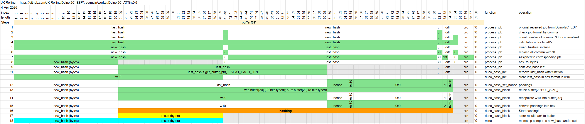

# DuinoI2C_ATTinyX5
This sketch is designed to run on AVR compatible devices like ATTiny45/85, Uno, Nano, Pro mini etc.
The design starts with memory efficiency in mind. With MCU like ATTiny45 of 256 bytes RAM and 4096 bytes flash, it took many ingenious optimization strategies (and sleepless night), 
including minimizing stack usage, buffer reuse, multi-purpose variables, custom lightweight function. With one goal in mind, preserve as much stack space as possible. If you know how memory allocation works, 
you'll see MCU crashing for no reason when stack overlap global variables.

## Features
You may customize feature based on your need. To save memory (disable all), shorter I2C transfer (no crc), reduce resistor (led dim), etc. Feel free to play around it to fit your need.
```C
/****************** USER MODIFICATION START ****************/
#define I2C_AD                      0x08           // I2C 7-bits address 0x01-0x7F
#define WDT_EN                      true           // watchdog to reset when hung
#define LED_EN                      true           // Enable LED output on LED_PIN
#define CRC_EN                      true           // crc8 protection for data integrity
/****************** USER MODIFICATION END ******************/

/****************** FINE TUNING START **********************/
#define LED_PIN                     PIN_PB1        // ATTiny->PB1:PWM PB3:GPIO PB4:GPIO; AT328P->LED_BUILTIN
#define LED_DIM                     false          // Dim LED. Set to true when LED do not have resistor
#define LED_MAX                     8              // 1-255. LED default brightness
#define SERIAL_EN                   false          // sw serial on PB4 for debug purpose. use ATTiny85 here.
/****************** FINE TUNING END ************************/
```


## Buffer reuse plan
As ATTiny45 only has 256 bytes of SRAM, there is not a lot of room to work. 

So I created this plan below to design the sketch. (actually, it is to save my effort to recall how it works in the future in case I need to revisit this)

[buffer reuse plan](https://docs.google.com/spreadsheets/d/1Yyu-0IxRnCqxKkMdPkqeNmSFGH9hO1d0EoCNjY_SVLw/edit?usp=sharing)



## Credits
* Duino-Coin team for the SHA1 hasher
* jpx13 doing validation, also for being the first person in the world to run it on ATTiny45
* I2C framework concept from ricaun
