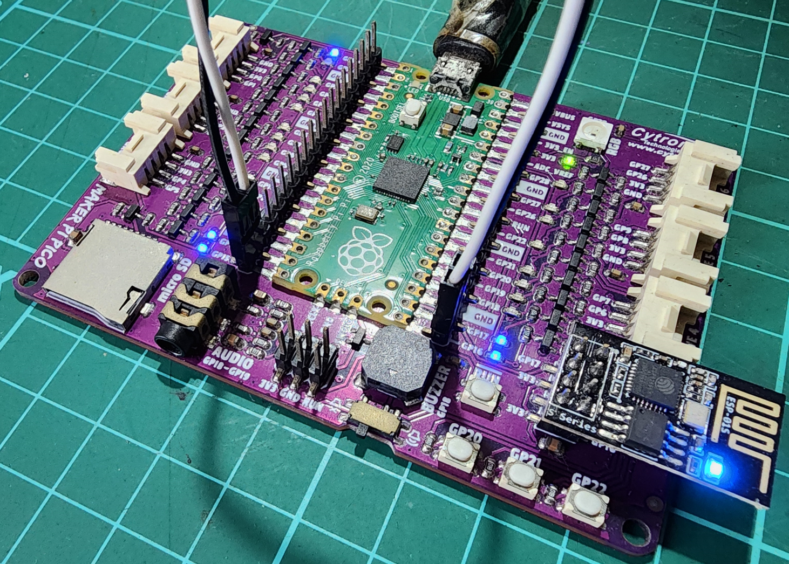

# DuinoI2C_ESP

## Overview
Worker is only responsible to receive job from ESP, find the result, and return the result to ESP, all via I2C. User will need to compile the source code in Arduino IDE and upload the firmware to the AVR.

> [!IMPORTANT]
> If you came from [DuinoCoinI2C](https://github.com/JK-Rolling/DuinoCoinI2C), make sure to reflash the worker with sketch from this repo. They are not backward compatible due to performance reason

## Supported Devices
|| UNO | NANO | Pro Mini | Atmel ATTiny85 | Pico RP2040 |
| :-: | :-: | :-: | :-: | :-: | :-: |
| DuinoCoinI2C_Tiny_Slave | ✅ | ✅ | ✅ | :x: | :x: |
| DuinoCoinI2C_ATTiny_Slave | :x: | :x: | :x: | ✅ | :x: |
| DuinoCoin_RPI_Pico_DualCore | :x: | :x: | :x:| :x: | ✅ | 

## Library Dependency
* [ArduinoUniqueID](https://github.com/ricaun/ArduinoUniqueID) (Handle the chip ID)
* [StreamJoin](https://github.com/ricaun/StreamJoin) (For Pico)

## Arduino IDE
Recommended version: 1.8.19

## Arduino Uno/Nano/Pro - Tiny_Slave
Arduino ATmega168/328 shall use `DuinoCoinI2C_Tiny_Slave` sketch. Logic-Level-Converter (LLC) is required if Arduino is operating at 5V and master at 3.3V.

Specific for Arduino Nano or Nano cloned, it is strongly recommended to update the bootloader to Optiboot to leverage watchdog timer (WDT) feature. WDT is important to make sure the AVR is restarted automatically whenever it is hanging for whatever reason over 4 seconds.

> [!IMPORTANT]
> Nano old bootloader will still run fine without Optiboot but the setting `WDT_EN` must be changed to `false` or the Nano will hang once timed out.

> [!NOTE]
> Due to Uno/Nano onboard LED is connected to non-PWM pin, so there will only be ON or OFF state and no dimming is possible. You may connect external LED to pin 3, 5, 6, 9, 10, or 11 to realise LED dimming. Power LED on the other hand, cannot be disabled from code. It can only be disabled by desoldering the LED or resistor.

### I2C Address
Increment the `DEV_INDEX` per device and upload.

Example:
||`DEV_INDEX`|I2C address|
|:-:|:-:|:-:|
|AVR0|0|1|
|AVR1|1|2|
|AVRx|X|X+1|

```C
/****************** USER MODIFICATION START ****************/
#define DEV_INDEX                   0
#define I2CS_START_ADDRESS          1
#define I2CS_FIND_ADDR              false
#define WDT_EN                      true        // recommended 'true', but do not turn on if using old bootloader
#define CRC8_EN                     true
#define LED_EN                      true
#define SENSOR_EN                   false
/****************** USER MODIFICATION END ******************/
```

## Atmel ATTiny85 - ATTiny_Slave
Use `DuinoCoinI2C_ATTiny_Slave` for ATtiny85. LLC is required if worker and host is operating at different voltage. 4k7 pullup resistors for `SDA/SCL` pins are strongly recommended. The TWI/I2C/IIC seems to work well with SCL 100KHz `WIRE_CLOCK 100000`.

ATtiny85 pin PB1 is using PWM to drive connected LED so resistor may be optional. In the case where resistor is necessary, use this equation to calculate the resistance. `R = (Vs - Vf) / If`. For LED of 2V forward voltage and 20mA, 5V may get 150 Ohm, 3.3V may get 65 Ohm. One may use higher value resistance where no exact resistor matches the calculated value.

Add `http://drazzy.com/package_drazzy.com_index.json`(broken?) or `https://github.com/SpenceKonde/ReleaseScripts/raw/refs/heads/master/package_drazzy.com_index.json` to `Additional Board Manager URLs` in Arduino IDE, then go to board manager and search for `attiny` and install ATTinyCore from Spence Konde.

ATTiny85 default system clock is 1MHz. This needs to be changed to get good hashrate. This sketch is applicable to Adafruit Trinket ATtiny85 too but the bootloader will be removed during fuse update to regain full 8KB flash capacity.

You may use dedicated ATTiny programmer or any Uno/Nano to set the fuse via `Tools --> Burn Bootloader`. See table below on setting that worked for me on ATtiny85. Make sure the `Tools --> Programmer --> Arduino as ISP` is selected. Finally upload sketch using `Sketch --> Upload Using Programmer`.

|Attribute|Value|
|:-|:-|
|Board|ATtiny25/45/85 (No Bootloader)|
|Chip|ATtiny85|
|Clock Source|16.5 MHz (PLL,tweaked)|
|Timer 1 Clock|CPU|
|LTO|Enabled|
|millis()/micros()|Enabled|
|Save EEPROM|EEPROM retained|
|B.O.D Level|Disabled|

### I2C Address
Increment the `ADDRESS_I2C` per device and upload.

Example:
||`ADDRESS_I2C`|I2C address|
|:-:|:-:|:-:|
|AVR0|1|1|
|AVR1|2|2|
|AVRx|X+1|X+1|
```C
/****************** USER MODIFICATION START ****************/
#define ADDRESS_I2C                 1             // manual I2C address assignment
#define CRC8_EN                     true
#define WDT_EN                      true
#define SENSOR_EN                   false         // use ATTiny85 internal temperature sensor
#define LED_EN                      true          // brightness controllable on pin 1
/****************** USER MODIFICATION END ******************/
```

## Raspberry Pi Pico
Pico shall use `DuinoCoin_RPI_Pico_DualCore`. LLC is not needed as Pico logic level is same as ESP. The default I2C SCL frequency is 400KHz so use [DuinoI2C_ESP.ino.d1_mini.400K.bin](https://github.com/JK-Rolling/DuinoI2C_ESP/raw/main/esp8266/DuinoI2C_ESP.ino.d1_mini.400K.bin) as the master.

Add `https://github.com/earlephilhower/arduino-pico/releases/download/global/package_rp2040_index.json` to `Additional Board Manager URLs` in Arduino IDE, then go to board manager and search for `Pico` and install board package from Earle Philhower. Use version 3.9.5 for stable operation.

Experiment the CPU clock frequencies ranging from 50-300MHz to find the sweet spot between job difficulty vs. hashrate. The CPU frequency recommended is 100MHz, which can be selected from Arduino IDE `Tools->CPU Speed`.
> [!CAUTION]
> stability not guaranteed when overclocked

Read the Knowledge Database in [kdb.ino](https://github.com/JK-Rolling/DuinoI2C_ESP/blob/main/worker/DuinoCoin_RPI_Pico_DualCore/kdb.ino) when making code changes which don't usually needed. The only change needed is  `DEV_INDEX`.

### I2C Address
Increment the `DEV_INDEX` per device and upload. Each Pico will take 2 addresses. 1 address for each core.

Example:
||`DEV_INDEX`|Core|I2C address|
|:-:|:-:|:-:|:-:|
|Pico0|0|0|8|
|Pico0|0|1|9|
|Pico1|1|0|10|
|Pico1|1|1|11|
|Picox|X|1|2*X+`I2CS_START_ADDRESS`|
|Picox|X|1|2*X+`I2CS_START_ADDRESS`+1|
```C
/****************** USER MODIFICATION START ****************/
#define DEV_INDEX                   10
#define I2CS_START_ADDRESS          8
#define I2CS_FIND_ADDR              false               // >>> see kdb before setting it to true <<<
#define WIRE_CLOCK                  400000              // >>> see kdb before changing this I2C clock frequency <<<
#define I2C0_SDA                    20
#define I2C0_SCL                    21
#define I2C1_SDA                    26
#define I2C1_SCL                    27
#define CRC8_EN                     true
#define WDT_EN                      true
#define CORE_BATON_EN               false
#define LED_EN                      true
#define SENSOR_EN                   true
#define SINGLE_CORE_ONLY            false               // >>> see kdb before setting it to true <<<
#define WORKER_NAME                 "rp2040"
/****************** USER MODIFICATION END ******************/
```

## Benchmarks of tested devices

  | Device                                                    | CPU Freq | Average hashrate<br>(all threads) | Mining<br>threads |
  |-----------------------------------------------------------|----------|-----------------------------------|-------------------|
  | Arduino Pro Mini, Uno, Nano etc.<br>(Atmega 328p/pb/16u2) |   16MHz  | 340 H/s                           | 1                 |
  | ATtiny85                                                  |  16.5MHz | 340 H/s                           | 1                 |
  | RP2040                                                    |  100MHz  | 4-5 KH/s                          | 2                 |

## Showcasing Ready Made Mining Rig - Cytron Maker Pi Pico

